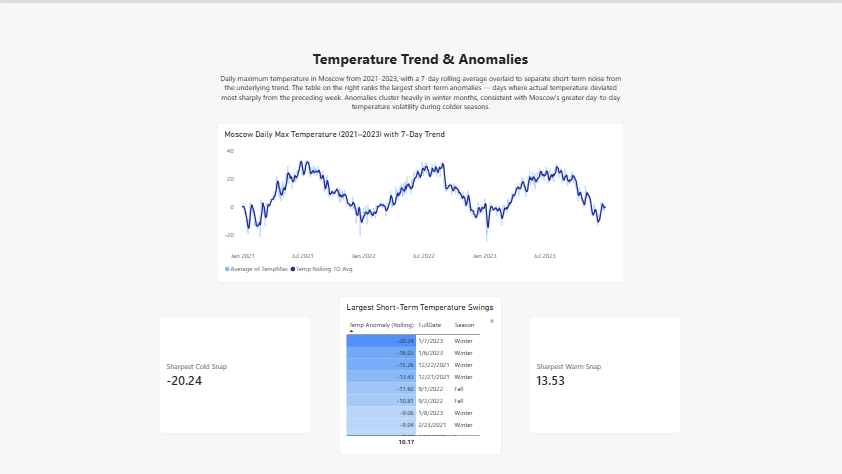
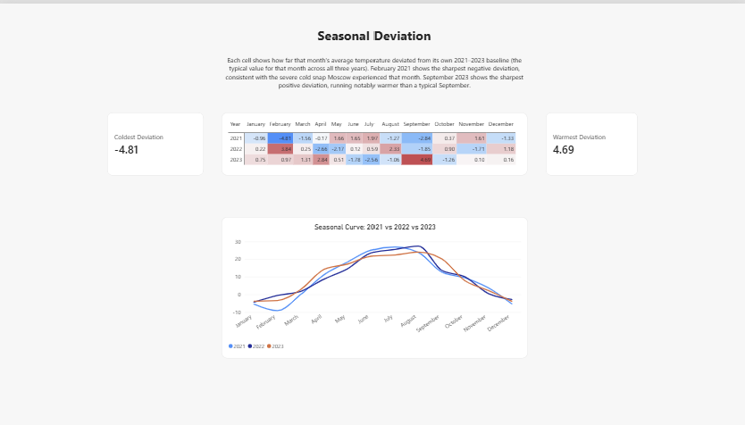

# Fabric Weather Dashboard

A weather trends analytics project built on Microsoft Fabric, using a scheduled Data Pipeline to ingest historical weather data from the Open-Meteo API, transform it into a star schema via a Spark notebook, and surface it through a Power BI report with time-series and anomaly detection measures.

## Architecture

Data flows: Open-Meteo API → Data Pipeline → Lakehouse (Files, raw JSON)
→ Spark notebook (parse + flatten + type cast) → Lakehouse (Delta tables)
→ Direct Lake semantic model → Power BI report.

Full write-up, including a real connector limitation we hit and worked
around, is in [`docs/architecture.md`](docs/architecture.md).

## Report

### Temperature Trend & Anomalies

### Seasonal Deviation

## Tech stack
- Microsoft Fabric (Data Pipeline, Lakehouse, Notebook, Power BI semantic model)
- Open-Meteo API (no auth required)
- PySpark
- DAX

## Status
✅ Complete — ingestion, transformation, semantic model, and report all built

## Contents
- `notebooks/` — Spark notebook exports for data transformation
- `dax/` — documented DAX measures
- `screenshots/` — report screenshots
- `docs/` — architecture notes and design decisions
